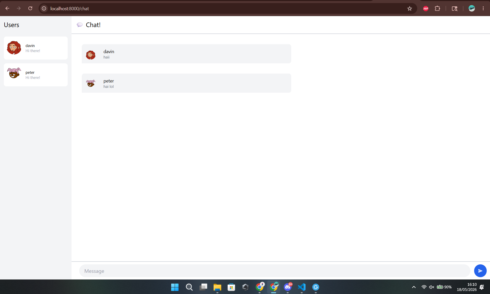
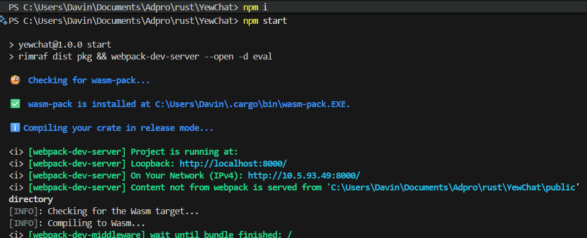
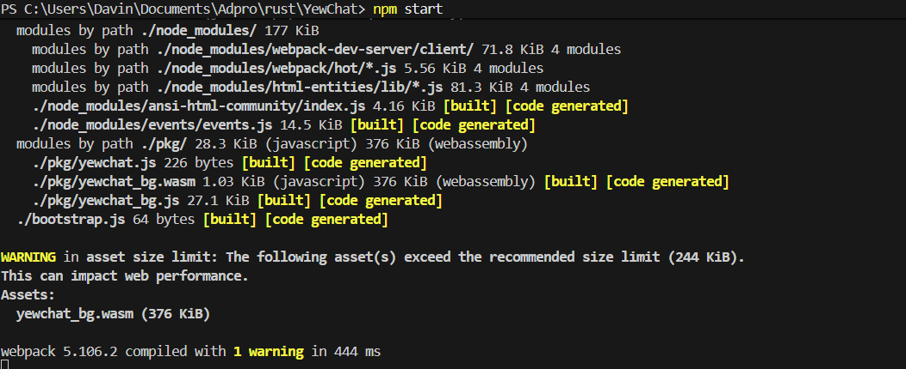

# Reflection Notes

## Cara Run

### 1. Clone backend (websocket) dari `https://github.com/jtordgeman/SimpleWebsocketServer.git`

### 2. Jalankan `npm i` dan `npm start` pada websocket.

### 3. Jalankan `npm i` dan `npm start` pada repo ini untuk menjalankan client di `localhost:8000`.

